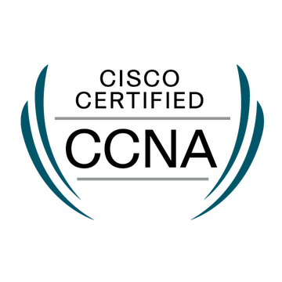
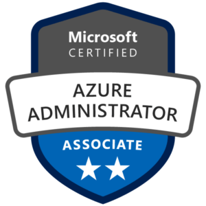
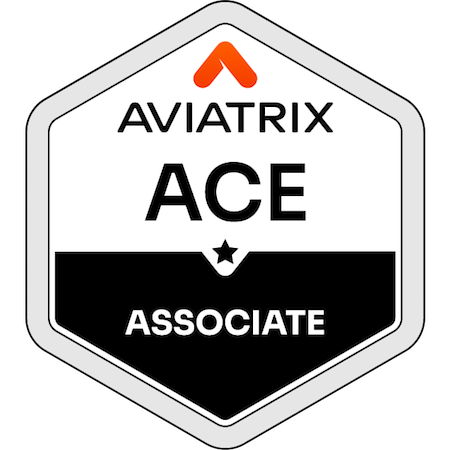
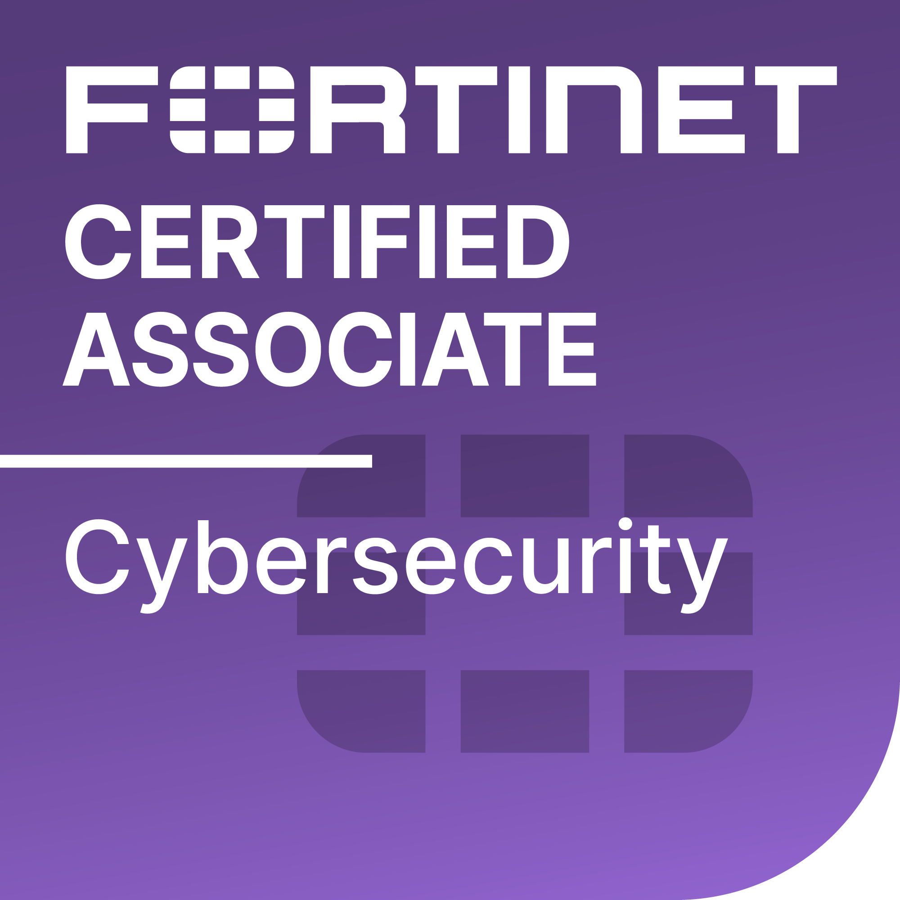

 
  

  &nbsp;&nbsp;&nbsp;&nbsp;&nbsp;&nbsp;&nbsp;
  
  &nbsp; 
  &nbsp;
  
  
  

   

---

### 👨‍💻 Professional Summary

I am a security-focused **Network Engineering Undergraduate** and **Batch Top Distinction Holder (3.95 GPA)** at NIBM, dedicated to architecting resilient infrastructure. My expertise lies in converging **Network Defense** with **High-Availability Systems**, transitioning complex theoretical security models into practical, production-ready deployments.

Currently, I am specializing in **Secure Baseline Hardening**, **Hybrid Cloud Security** (Azure/OCI), and **Enterprise Linux-Windows Integration**.

* 🔭 **Current Focus:** Designing fault-tolerant network architectures & Layer 7 Load Balancing.
* 🌱 **Professional Development:** Advancing in ISO 27001 Audit Standards & SOC Defense Methodologies.
* 🛡️ **Core Competencies:** Network Defense, Cloud Identity (IAM), Infrastructure Hardening (Linux/Windows).

---

### 🛠️ Technical Arsenal

| Network & Security | Cloud & Virtualization | Tools & Automation |
| :---: | :---: | :---: |
|  |  |  |
|  |  |  |
|  |  |  |

---

### 🏆 Professional Qualifications 

  
  
  
  &nbsp&nbsp&nbsp;
  
  &nbsp&nbsp&nbsp;
  
  &nbsp&nbsp&nbsp;
  
  &nbsp&nbsp&nbsp;
  
  &nbsp&nbsp&nbsp; 
  
  &nbsp&nbsp&nbsp; 
  
  &nbsp&nbsp&nbsp; 
  
  &nbsp&nbsp&nbsp;
  
  &nbsp&nbsp&nbsp;
      
  
  &nbsp&nbsp&nbsp;
  
  &nbsp&nbsp&nbsp;
  

---

